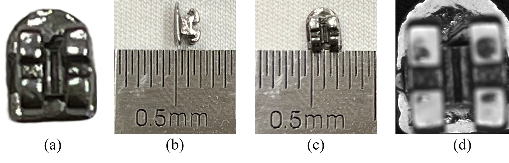
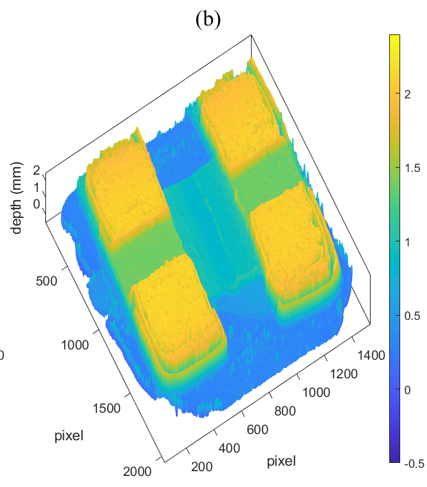

Welcome to my page! This is Zhoumiao He, a third-year doctoral student in the College of Computer Science, at Sichuan University, under Prof. [Jianwei Zhang](https://vs.scu.edu.cn/info/1062/1369.htm). 
I am currently participating in a dual PhD program to continue my research at the Department of Industrial and Systems Engineering(**ISE**) of the Hong Kong Polytechnic University, under the supervision of Prof. [Benny C.F. Cheung](https://www.polyu.edu.hk/ise/people/academic-staff/benny-cf-cheung/).

My research interests include **three-dimensional topography**, **complex surface characterization**; and **computational imaging**. 
I am currently very interested in the measurement methods for complex microdevice morphology(as shown below). You are welcome to exchange advice!

 

  
The surface has HDR properties because of the metal material, as well as the obstruction of light source and mutual reflection caused by the deep grooves. The recovered depth map is shown as follows and there is still significant room for improvement in measurement accuracy.

 

Welcome to exchange advice about this issue！

hobbies
-------
Traveling is my favorite, and I enjoy interacting with friends from different places. The most beautiful scenery is always on the road.

acknowledgment
-------
This is the front page of my website powered by the [academicpages template](https://academicpages.github.io/)    

Thanks for [Yi Zhou](https://echochou990919.github.io/)'s help.

